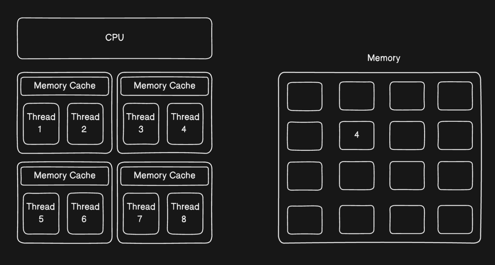
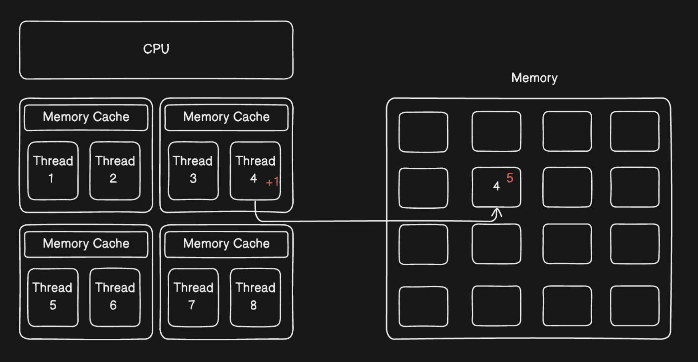
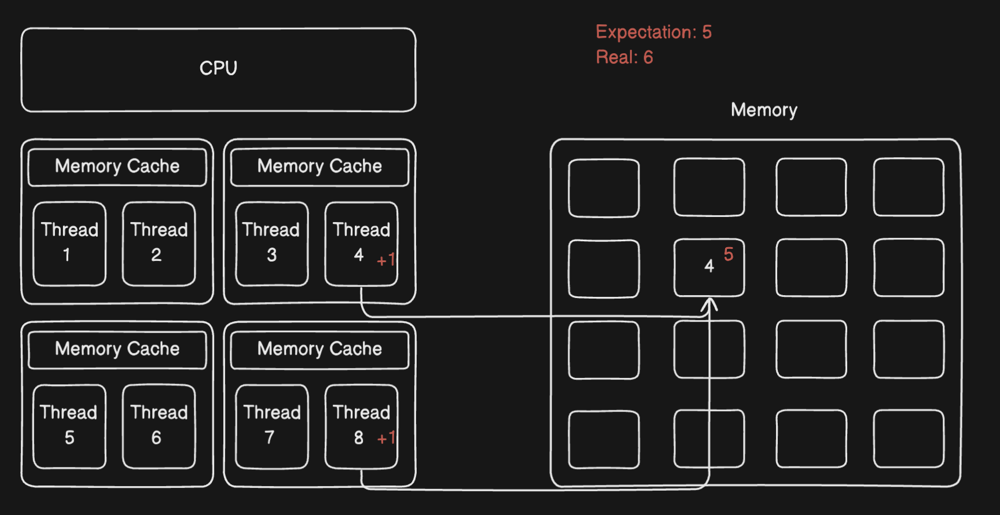

# Giải thích đơn giản Mutex, Arc 
Hiện tại đối với kiến thức của mình thì vẫn chưa hiểu tầng sâu nhất của memory, thread, process, ... đây là những khái niệm quan trọng trong lập trình `concurrency`.  Hi vọng trong tương lai sẽ có bài deep dive hơn về các kiến thức cơ bản này. 

Bây giờ chúng ta sẽ đi tìm hiểu kiến thức cơ bản trước , đó là 

## Thread và Process


## Mutex 
### Lý do có Mutex 
Ví dụ: 
1. Ta có 1 chương trình như sau 
```rust
let x = 4;
```

Memory sẽ lưu giá trị 4 ở 1 vùng nhớ nào đó 




2. Nâng cấp chương trình code như sau:
```rust
let mut x = 4;
    x +=1; 
```
+ Đối với trường hợp single-thread thì ko xảy ra vấn đề




CPU đọc giá trị từ Memory (x =4) -> Xử lý chương trình `+1` (ở đây thread 4 xử lý) -> Lưu giá trị mới vào memory (x=5)

+ Đối với trường hợp xử lý multi-thread thì lại có vấn đề như sau 



CPU đọc giá trị từ Memory (x=4) -> Có 2 thread cùng truy cập vùng nhớ của x -> Xử lý gần như đồng thời chương trình `+1` -> Kết quả thực tế có thể là `6` 

Khi xử lý multi-thread thì có thể xuất hiện lỗi `data race` , là một lỗi phổ biến khi mà 2 hoặc nhiều thread cùng truy cập một vùng nhớ và xử lý cùng 1 chương trình 


### Mutex là gì 
Mutex (mutual exclusion) là một cơ chế đồng bộ chỉ cho phép 1 thread truy cập dữ liệu tại 1 thời điểm 

Có 2 quy tắc chính: 

1. Muốn truy cập được dữ liệu trong `Mutex` , thread đó phải đưa ra tín hiệu cho Mutex bằng cách `lock()` dữ liệu đó
2. Vì  Mutex có nhiệm vụ cho phép duy nhất 1 thread truy cập dữ liệu tại 1 thời điểm , khi 1 thread đã hoàn thành xong chương trình , cần `unlock` để các thread khác có thể truy cập 


### Biểu diễn code : Single-thread 

```rust
use std::sync::Mutex;

fn main() {
    // wrap giá trị 5 cho Mutex 
    let m = Mutex::new(5);

    {
        // Lock 
        // chỉ có main thread mới được access và thay đổi giá trị 
        let mut num = m.lock().unwrap();
        *num = 6;
    }

    println!("m = {m:?}");
}
```

### Biểu diễn code : Multi-thread 

Bài toán : Đếm số từ 0 tới 9 sử dụng multi-thread 

```rust
use std::sync::Mutex;
use std::thread;

fn main() {
    let counter = Mutex::new(0);
    let mut handles = vec![];

    for _ in 0..10 {
        // tạo ra 1 thread mới
        // giải thích cú pháp move 
        // Khi dùng move trong closure -> tính ownership của biến counter sẽ chuyển cho owner khác trong scope của thread 
        // Nếu không dùng move trong closure -> sử dụng reference của biến counter trong scope của thread -> Compile Error bởi vì thời gian sống (lifetime) của thread < lifetime của biến counter -> Nghĩa là biến counter vẫn còn tồn tại trong khi scope của thread đã kết thúc -> Vi phạm quy tắc ownership 
        let handle = thread::spawn(move || {
            // lock 
            // cho phép thread duy nhất hiện tại được access biến counter
            let mut num = counter.lock().unwrap();

            *num += 1;
        });
        handles.push(handle);
    }

    for handle in handles {
        // chờ tất cả các thread con thực hiện xong 
        // thì khi đó chương trình kết thúc (main thread kết thúc)
        handle.join().unwrap();
    }

    println!("Result: {}", *counter.lock().unwrap());
}
```

Khi chạy cargo run:
```
error[E0382]: borrow of moved value: `counter`
   --> src/main.rs:119:29
    |
103 |     let counter = Mutex::new(0);
    |         ------- move occurs because `counter` has type `Mutex<i32>`, which does not implement the `Copy` trait
...
107 |         let handle = thread::spawn(move || {
    |                                    ------- value moved into closure here, in previous iteration of loop
...
119 |     println!("Result: {}", *counter.lock().unwrap());
    |                             ^^^^^^^ value borrowed here after move

For more information about this error, try `rustc --explain E0382`.
```

### Vấn đề:
+ Vòng lặp đầu tiên -> biến `counter` đã chuyển ownership trong phạm vi scope của thread -> biến `counter` sẽ drop sau khi scope thread kết thúc -> Khi đến vòng lặp thứ 2 -> biến `counter` không còn tồn tại -> Lỗi ownership 

=> Chúng ta không thể `move` tính ownership của biến `counter` cho nhiều thread được 


### Giải pháp cho vấn đề sử dụng Mutex - Multi-Thread 

=> Sử dụng Multiple Ownership với Multiple Threads 

=> Sử dụng smart pointer `Rc<T>` 
=> Mọi người có thể tham khảo : https://www.youtube.com/watch?v=8O0Nt9qY_vo


Cũng như code trên, nhưng chúng ta sẽ sử dụng thêm `clone` để tạo nhiều ownership với nhiều thread

```rust
use std::rc::Rc;
use std::sync::Mutex;
use std::thread;

fn main() {
    // Wrap Mutex và Rc 
    // Chức năng:
    // Mutex: cho phép 1 thread truy cập cùng 1 thời điểm 
    // Rc: Reference Counted -> Tạo mutile ownership 

    let counter = Rc::new(Mutex::new(0));
    let mut handles = vec![];

    for _ in 0..10 {
        // Tạo 1 ownership tương ứng cho 1 thread 
        let counter = Rc::clone(&counter);
        let handle = thread::spawn(move || {
            let mut num = counter.lock().unwrap();

            *num += 1;
        });
        handles.push(handle);
    }

    for handle in handles {
        handle.join().unwrap();
    }

    println!("Result: {}", *counter.lock().unwrap());
}
```

### Vấn đề khi sử dụng Rc

```
error[E0277]: `Rc<Mutex<i32>>` cannot be sent between threads safely
   --> src/main.rs:142:36
    |
142 |           let handle = thread::spawn(move || {
    |                        ------------- ^------
    |                        |             |
    |  ______________________|_____________within this `{closure@src/main.rs:142:36: 142:43}`
    | |                      |
    | |                      required by a bound introduced by this call
143 | |             let mut num = counter.lock().unwrap();
144 | |
145 | |             *num += 1;
146 | |         });
    | |_________^ `Rc<Mutex<i32>>` cannot be sent between threads safely
    |
    = help: within `{closure@src/main.rs:142:36: 142:43}`, the trait `Send` is not implemented for `Rc<Mutex<i32>>`
note: required because it's used within this closure
   --> src/main.rs:142:36
    |
142 |         let handle = thread::spawn(move || {
    |                                    ^^^^^^^
note: required by a bound in `spawn`
   --> /Users/hodung/.rustup/toolchains/1.74-aarch64-apple-darwin/lib/rustlib/src/rust/library/std/src/thread/mod.rs:683:8
    |
680 | pub fn spawn<F, T>(f: F) -> JoinHandle<T>
    |        ----- required by a bound in this function
...
683 |     F: Send + 'static,
    |        ^^^^ required by this bound in `spawn`
```

=> Khi sử dụng `Rc<T>` thì compiler báo lỗi liên quan tới `thread-safe` 
=> Nên nhớ rằng : Các thread sẽ cùng truy cập chung 1 memory (Shared-stated concurrency) 


### Giải pháp khi sử dụng share-stated (các thread có thể access cùng 1 resource)

=> Sử dụng Atomic Reference Counting (`Arc<T>`)
=> Tại vì sao có Atomic ( Mình xin phép chia sẻ bài khác). Mọi người có thể tham khảo video này: 
https://www.youtube.com/watch?v=rMGWeSjctlY&t=8529s


=> Rust đảm bảo khi sử dụng Arc thì thead-safe , có nghĩa là an toàn dữ liệu khi mà chạy đa luồng 

=> Cách sử dụng khá giống với `Rc<T>` 

```rust
use std::sync::{Arc, Mutex};
use std::thread;

fn main() {

    // Wrap Mutex trong Arc
    // Mutex: cho phép 1 thread truy cập giá trị tại cùng 1 thời điểm
    // Arc: share-stated thread-safe
    let counter = Arc::new(Mutex::new(0));
    let mut handles = vec![];

    for _ in 0..10 {
        let counter = Arc::clone(&counter);
        let handle = thread::spawn(move || {
            let mut num = counter.lock().unwrap();

            *num += 1;
        });
        handles.push(handle);
    }

    for handle in handles {
        handle.join().unwrap();
    }

    println!("Result: {}", *counter.lock().unwrap());
}
```

=> Kết quả : `Result: 10` 


## Kết luận 

Khi sử dụng Arc<T> cùng với Mutex<T> thì ta giải quyết được 2 vấn đề khi chạy concurrency

1. Mutex: Tránh hiện tượng `data race` , nghĩa là chỉ duy nhất 1 thread truy cập giá trị tại cùng 1 thời điểm 

2. Arc : Thread-safe khi nhiều thread cùng sử dụng 1 memory 

